# GoPansa
### Image-based meat grade automatic measurement service

<h3 align="center">Our Icon</h3>

  </img>

 

## 👨‍👦‍👦 Members 
- [Minku Koo](https://github.com/Minku-Koo) &nbsp;/&nbsp; *corleone@kakao.com*
- [Jiyong Park](https://github.com/Ji-yong219) &nbsp;/&nbsp; *wldydslapjyy@naver.com*
- [Heebeom Yang](https://github.com/takeny1998) &nbsp;/&nbsp; *takeny1998@gmail.com*
- [Hyunmoo Lee](https://github.com/Im-flying-sparrow) &nbsp;/&nbsp; *hm11l1@naver.com*

## 📃 Table of Contents
- [Members](#-members)
- [DataSet](#-dataset)    
- [Deep Learning Model Performance](#-deep-learning-model-performance)
- [WBS](#-wbs)
- [User Interface](#-user-interface)
- [SW Architecture](#-sw-architecture)
- [Award](#-award)
- [Articles](#-articles)

## 💾 DataSet
#### We get data from [AI HUB : 축산물 품질(QC) 이미지](https://aihub.or.kr/aidata/30733)
### 💿 Sample Data
**Cow (Grade 1++, 1+) : 60,000 장**

  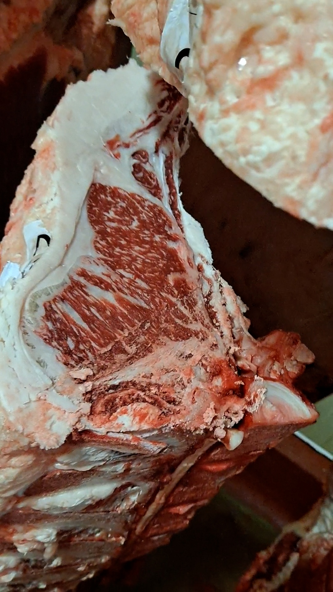</img>
  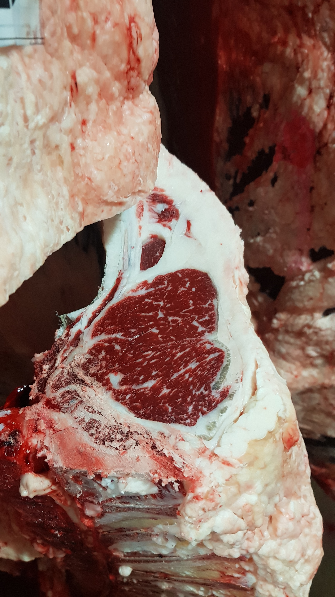</img>

**Pig (Grade 1+, 1) : 10,000 장**

  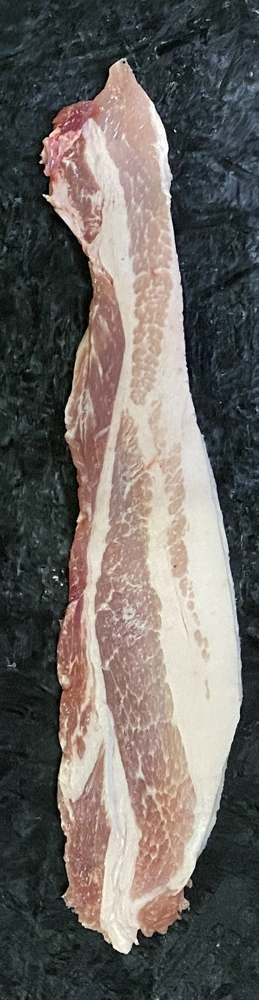</img>
  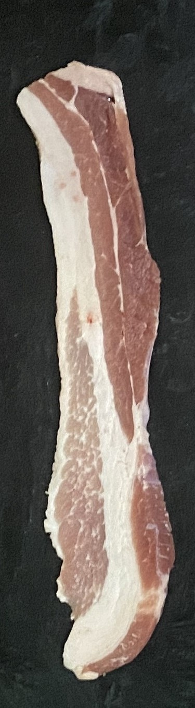</img>

## 📊 Deep Learning Model Performance
+ ### Using ResNext Model
+ ### Transfer Learning through Fine Tuning

**📈 Train Accuracy (Cow, Pig)**

  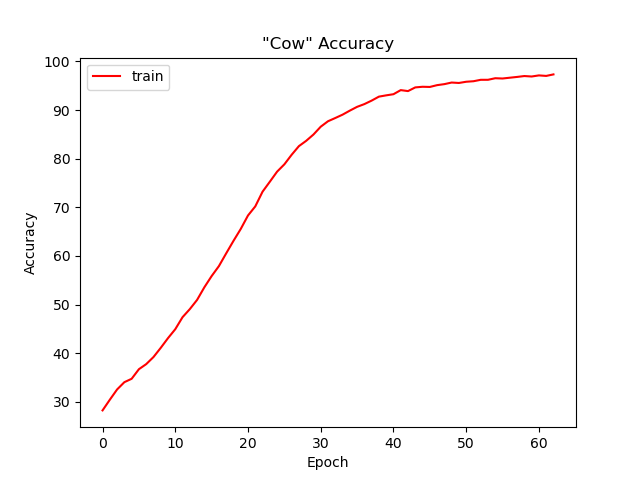</img>
  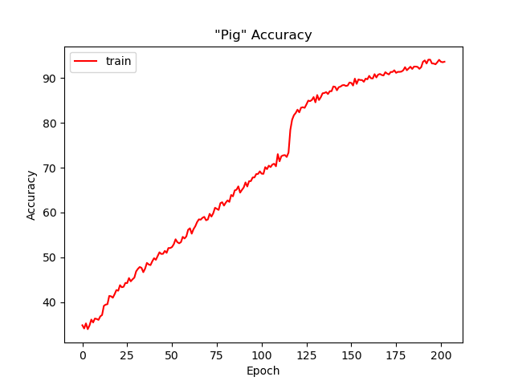</img>

**📉 Train Loss (Cow, Pig)**

  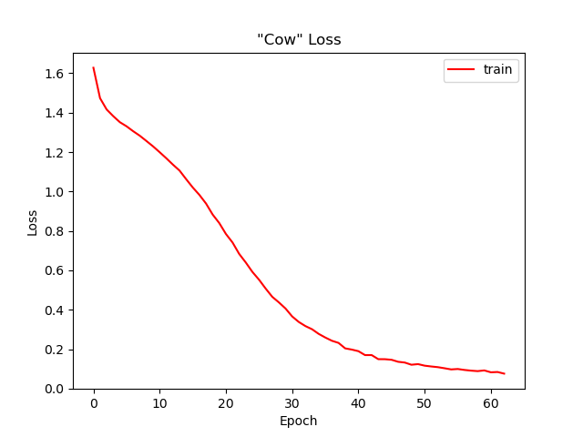</img>
  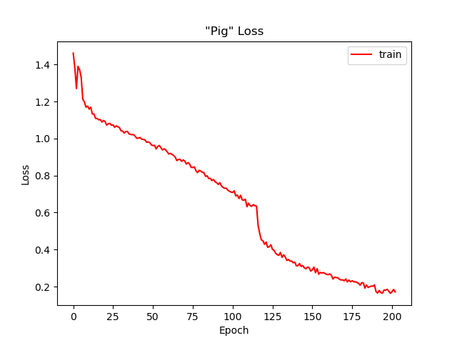</img>

## 🛠 WBS

  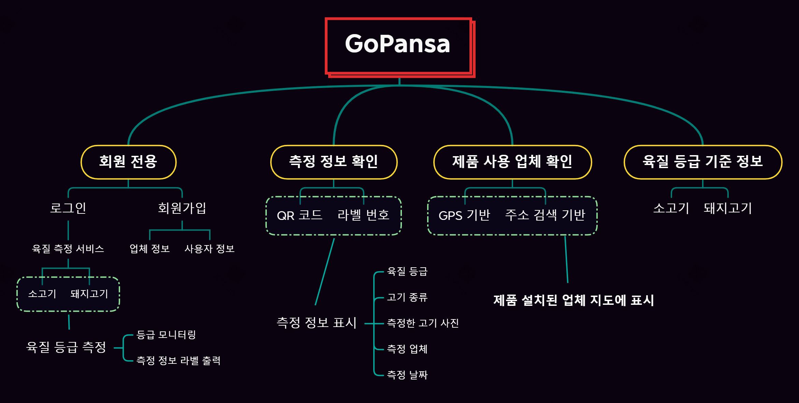</img>

 

## 🖥 User Interface

### Index Page

  </img>

 

### Register Profile & Store

  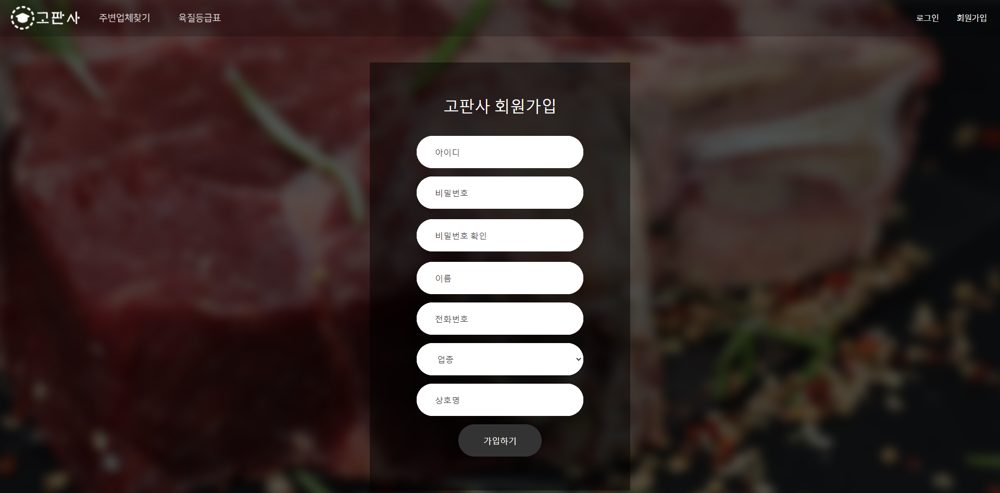</img>
  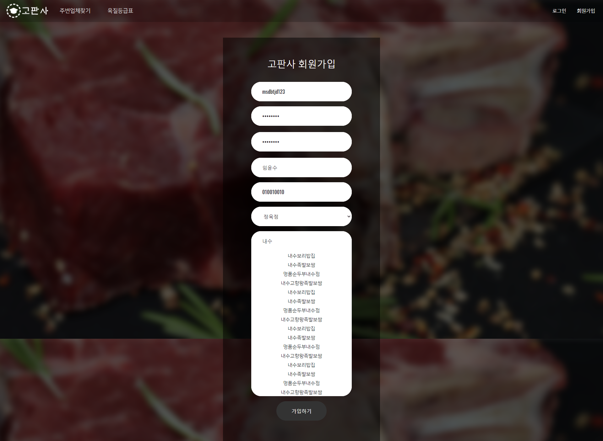</img>

 

### MyPage & Payment

  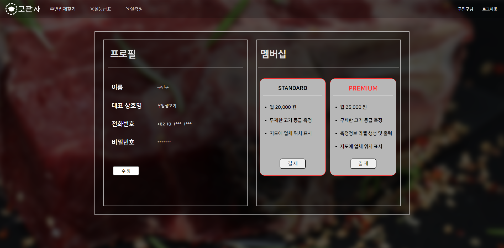</img>
  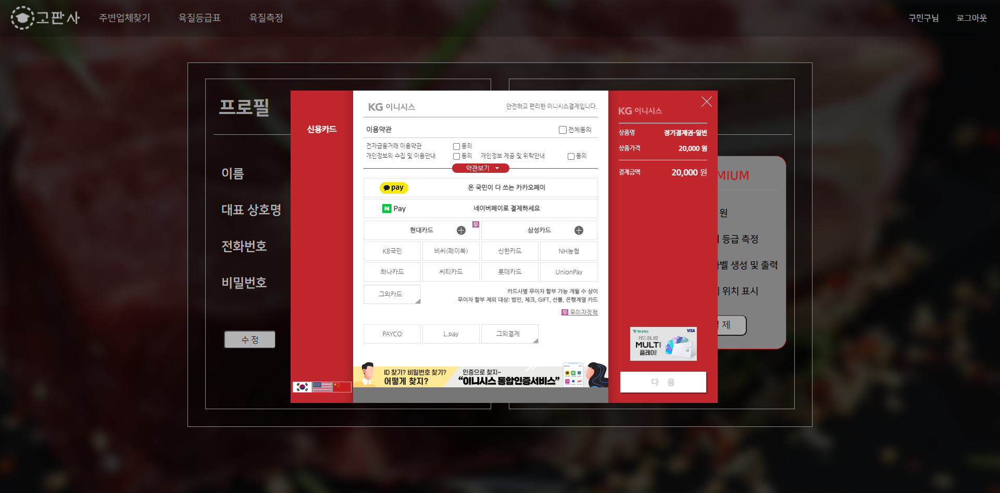</img>

 

### Check Meat Grade (Cow)

  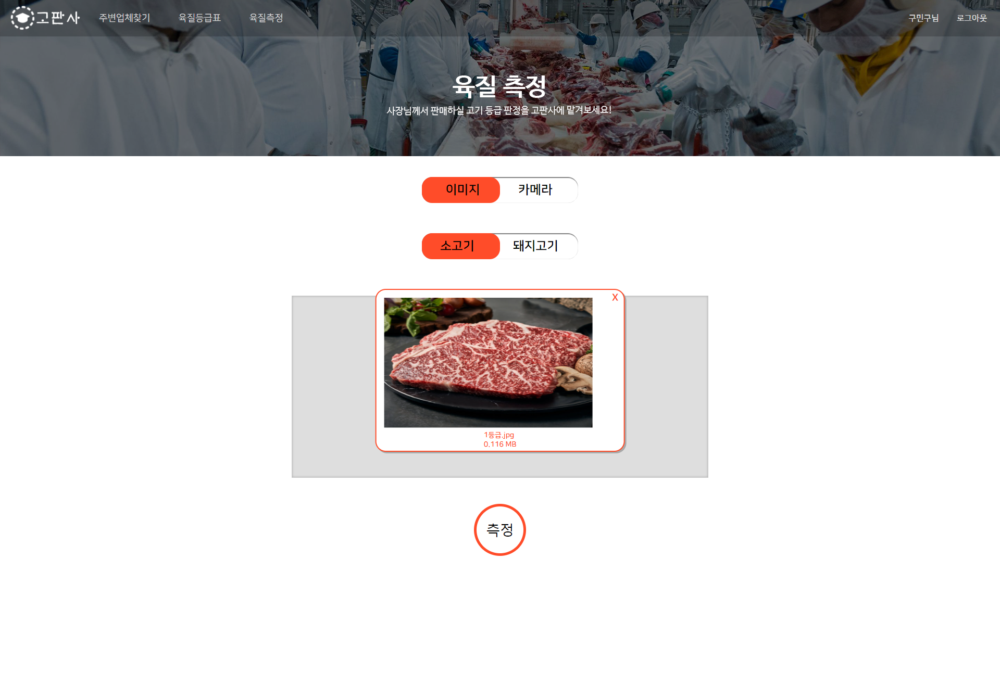</img>
  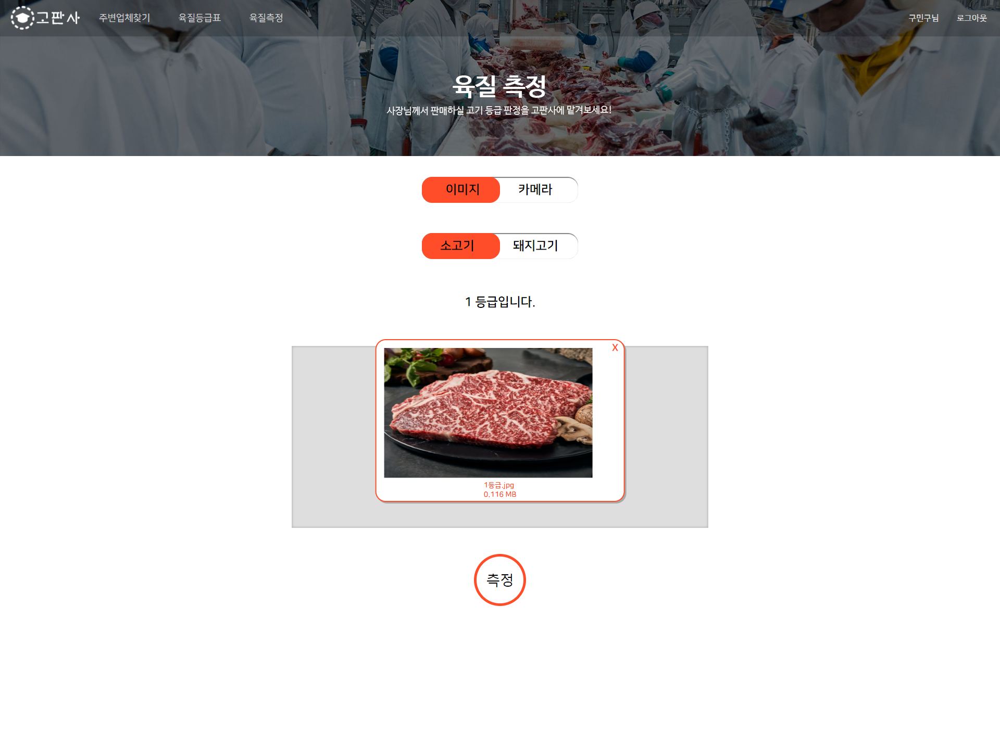</img>

 

### Show Meat Grade Table (Cow & Pig)

  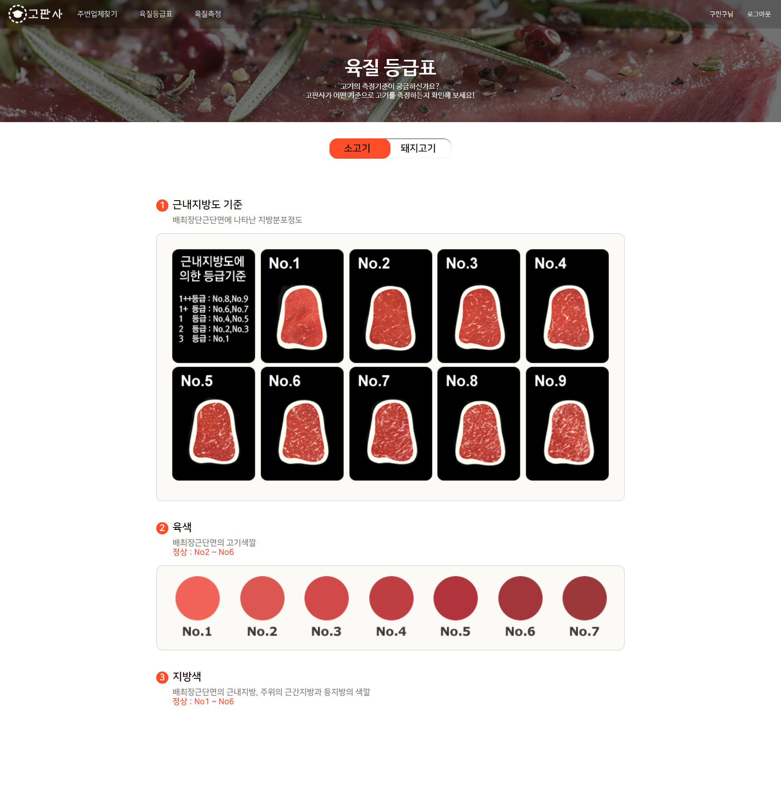</img>
  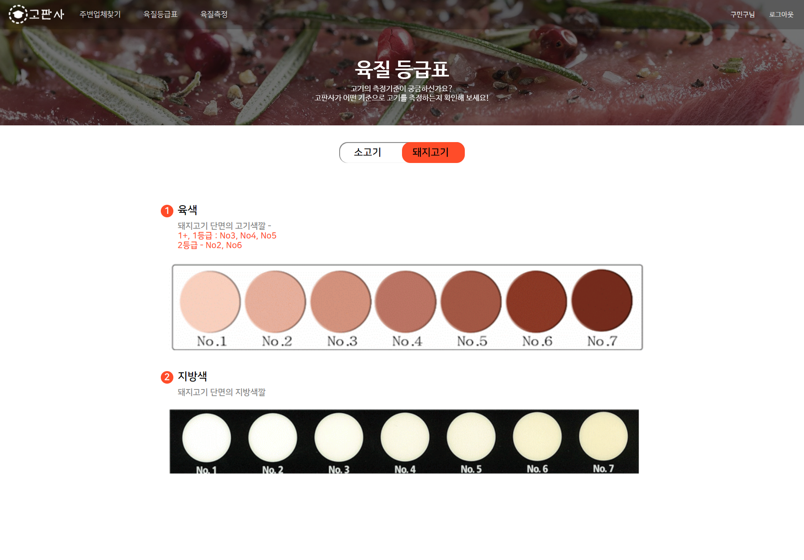</img>

 

### Map

  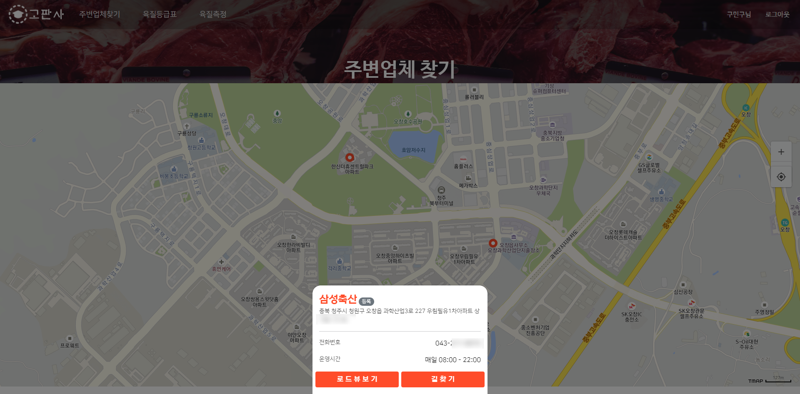</img>

 

## ⚙ SW Architecture

  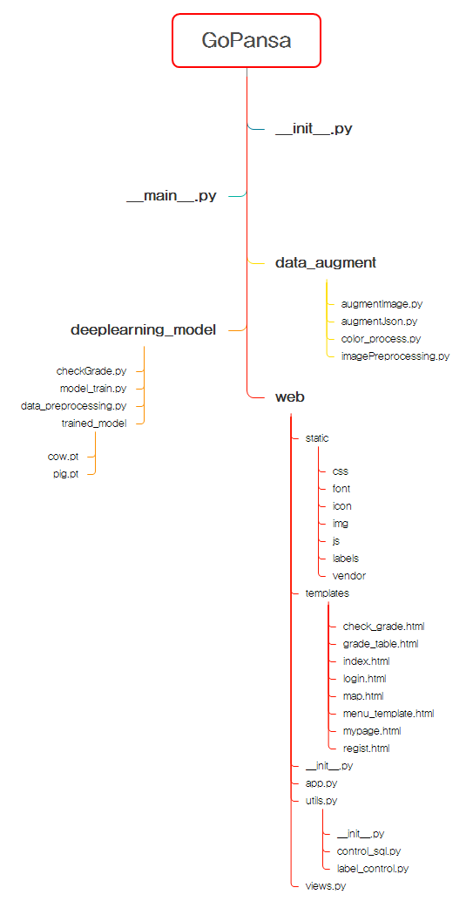</img>

 

## 🏆 Award
### 2021년 제 2회 충북 공공데이터활용 창업경진대회 최우수상 수상

  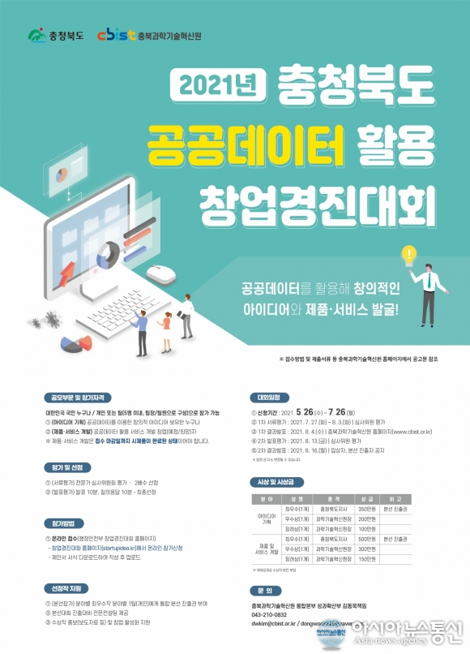</img>

 

## 📰 Articles

- [충북과기원, 공공데이터 활용 창업경진대회 본선 2개팀 진출](https://news.naver.com/main/read.naver?mode=LSD&mid=sec&sid1=001&oid=030&aid=0002963578)
- [청주대, 공공데이터 창업경진대회 최우수상](http://www.kyosu.net/news/articleView.html?idxno=74608)
- [청주대, 고기 사진만으로 육질 등급 측정 가능 ‘앱’ 개발](http://cc.newdaily.co.kr/site/data/html/2021/08/23/2021082300146.html)

