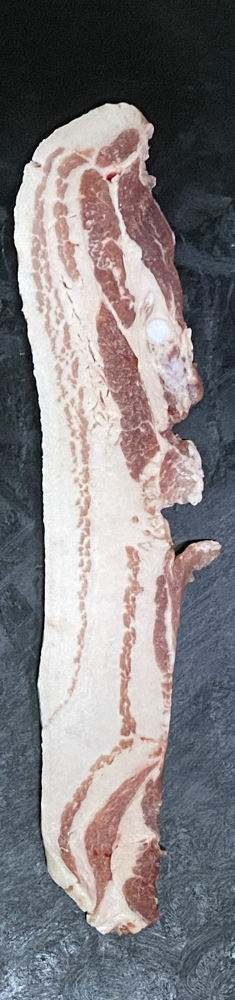
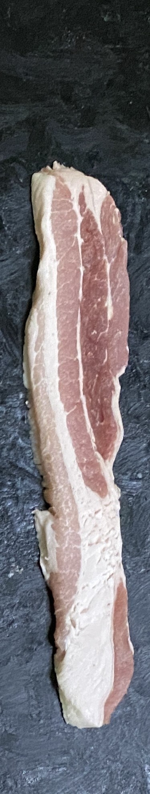

# GoPansa
### Image-based meat grade automatic measurement service

<h3 align="center">Our Icon</h3>

  </img>

 

## 👨‍👦‍👦 Members 
- [Minku Koo](https://github.com/Minku-Koo) / corleone@kakao.com   
- [Jiyong Park](https://github.com/Ji-yong219) / wldydslapjyy@naver.com
- [Heebeom Yang](https://github.com/takeny1998) / takeny1998@gmail.com
- [Hyunmoo Lee](https://github.com/Im-flying-sparrow) / hm11l1@naver.com

## 📃 Table of Contents

## 💾 DataSet
#### We get data from [AI HUB : 축산물 품질(QC) 이미지](https://aihub.or.kr/aidata/30733)
#### 💿 Sample Data
**Cow (Grade 1++, 1+)**

  </img>
  </img>

**Pig (Grade 1+, 1)**

  </img>
  </img>

## 📈 Deep Learning Model Performance

## 🛠 WBS

  </img>

 

## 🖥 User Interface

## ⚙ SW Architecture

## 🏆 Award

## 📰 Articles

- [충북과기원, 공공데이터 활용 창업경진대회 본선 2개팀 진출](https://news.naver.com/main/read.naver?mode=LSD&mid=sec&sid1=001&oid=030&aid=0002963578)
- [창업경진대회 본선 진출팀 선정](http://www.ccdn.co.kr/news/articleView.html?idxno=718613#09SX)

